## How opted-in is determined

A venue is "opted into rewards" when it has a `reward_programs` row with `is_enabled=True` — this already exists via `Venue.reward_program` (`hour_rewards.models.RewardProgram`). Today `VenueResponse` never surfaces this, so the mobile app has no way to know.

```mermaid
flowchart LR
    Venue -->|reward_program relationship| RewardProgram
    RewardProgram -->|"RewardService.is_program_active()"| hasRewards["has_rewards: bool"]
    hasRewards -->|new field| VenueResponse
    VenueResponse -->|api.d.ts codegen| MobileVenueResponse["VenueResponse (mobile)"]
    MobileVenueResponse -->|"v.has_rewards"| RewardsFilterChip
```

## Backend — logic in the vendor SDK, plumbing in the host

- [backend/vendor/hour-rewards-sdk/hour_rewards/service.py](backend/vendor/hour-rewards-sdk/hour_rewards/service.py): add `RewardService.is_program_active(program: Optional[RewardProgram]) -> bool`, the same `program is not None and program.is_enabled` rule already inlined in `get_punch_card_summary`, now reusable. This keeps the "what counts as opted-in" rule inside the public package rather than duplicated in host code.
- [backend/shared/models/venue.py](backend/shared/models/venue.py): add `has_rewards: bool = False` to `VenueResponse`.
- [backend/shared/services/deal.py](backend/shared/services/deal.py):
  - Add `selectinload(Venue.reward_program)` to the venue queries in `get_nearby_venues_with_deals`, `get_nearby_venues_search`, and `get_venue_with_deals` (mirrors the existing `selectinload(Venue.deals...)` pattern).
  - In `get_venue_response_with_deals`, set `has_rewards=RewardService.is_program_active(venue.reward_program)` (import `RewardService` from `hour_rewards.service`).
- No cache-key changes needed — `has_rewards` defaults to `False` so already-cached JSON blobs deserialize fine via `VenueResponse.model_validate`.

## Mobile — chip visuals in the vendor UI package, wiring in the host

- [mobile/vendor/hour-rewards-ui/src/RewardsFilterChip.tsx](mobile/vendor/hour-rewards-ui/src/RewardsFilterChip.tsx) (new): a self-contained chip (`Gift` icon from `lucide-react-native`, already a peer dep) styled with the package's own `REWARD_COLORS`/`S` tokens, which are numerically identical to the host's `COLORS` — so it matches `FilterList.Button` and `FilterChip` pixel-for-pixel without importing host theme. Props: `active`, `onPress`, optional `label` (default `"Rewards"`).
- [mobile/vendor/hour-rewards-ui/src/index.ts](mobile/vendor/hour-rewards-ui/src/index.ts): export `RewardsFilterChip`.
- [mobile/src/components/FilterList.tsx](mobile/src/components/FilterList.tsx): add an optional `leadingChip?: React.ReactNode` slot prop (Pattern 2 — named slot), rendered inside the `ScrollView` before `visibleFilters.map(...)`. `FilterList` stays generic and doesn't need to know about rewards.
- [mobile/src/AppState.tsx](mobile/src/AppState.tsx) / [mobile/src/AppContext.tsx](mobile/src/AppContext.tsx): add `rewardsOnly: boolean` + `setRewardsOnly` next to `tagFilters`, so the toggle persists across Home ↔ Map like tag filters do.
- [mobile/src/types/api.d.ts](mobile/src/types/api.d.ts): regenerate via `npm run generate:api` (needs the backend running locally) to pick up `has_rewards` on `VenueResponse`.
- [mobile/app/(tabs)/index.tsx](mobile/app/(tabs)/index.tsx): read `rewardsOnly`/`setRewardsOnly` from context; filter the venue list (`venues.filter(v => v.has_rewards)` when active) before it's handed to `useFilteredVenues`, so tag pool/search/buckets all reflect the narrowed set for free; pass `leadingChip={<RewardsFilterChip active={rewardsOnly} onPress={...} />}` to `FilterList`.
- [mobile/app/(tabs)/map.tsx](mobile/app/(tabs)/map.tsx): same `rewardsOnly` filtering added to the `mapVenues` memo (alongside the existing `openNowOnly`/`topRatedOnly` filters) and to `handleSubmitMapSearch`; pass `rewardsOnly`/`onRewardsOnlyChange` down to `MapSearchFilters`.
- [mobile/src/components/MapSearchFilters.tsx](mobile/src/components/MapSearchFilters.tsx): accept `rewardsOnly`/`onRewardsOnlyChange` props and render `<RewardsFilterChip>` as the first chip in the row (before the "when" chip).
- [mobile/src/utils/analyticsFilterLabels.ts](mobile/src/utils/analyticsFilterLabels.ts): extend `buildMapActiveFilterLabels`'s options with `rewardsOnly` (push `'rewards'`), and add the same to the list screen's tracking call, matching the existing `top_rated`/`open_now` pattern.

## Out of scope

- No changes to `FavoriteTagsSelector`/onboarding tag pickers (those are about `VenueTag` preferences, not this synthetic filter).
- No rewards badge added to venue cards — this plan only covers the filter chip itself.
