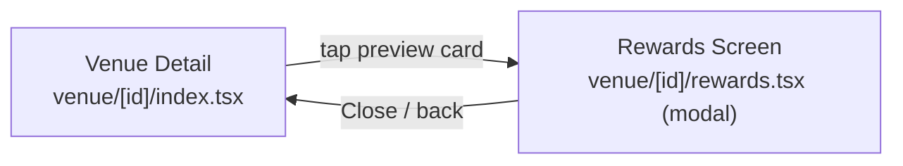

## Context

- DB plan: [.cursor/plans/venue_rewards_punch_card_system_5299d161.plan.md](.cursor/plans/venue_rewards_punch_card_system_5299d161.plan.md) — schema only; explicitly defers `RewardService` and API routes.
- Confirmed via exploration: mobile has no `features/` folder, no React Query — data comes from inline `useEffect`/`useState` + `*Api` helpers in `mobile/src/utils/api.ts`, or Zustand stores.
- **This plan is UI-only** (per your answer): screens are built against a typed mock data module so wiring in real endpoints later is a drop-in swap.

## Navigation pattern (reuse existing convention)

The "profile → preferences" modal pattern is already used for a sibling route on this exact screen: `venue/[id]/edit`. Rewards will follow the identical convention as a new sibling route `venue/[id]/rewards`.

```8:88:mobile/app/_layout.tsx
<Stack.Screen name="venue/[id]/index" options={{ headerShown: false, title: 'Venue Details' }} />
<Stack.Screen
  name="venue/[id]/edit"
  options={{
    headerShown: true,
    header: () => <ProfileModalHeader title="Edit venue" />,
    presentation: 'modal',
    contentStyle: { backgroundColor: COLORS.bg2 },
  }}
/>
```

Add a new `Stack.Screen` for `venue/[id]/rewards` right after it, with `header: () => <ProfileModalHeader title="Rewards" />` — giving the exact "drag pill + Close/Back + centered title" chrome the user asked for ("same style of page that profile→preferences opens").



## 1. Mock data module — `mobile/src/utils/rewardsMock.ts` (new)

Shaped to match what the DB plan's deferred "my punch cards" endpoint would return, so swapping to a real `rewardsApi` later means replacing these two functions only:

```ts
export type PunchCardSummary = {
  punchesEarned: number;
  punchesRequired: number;
  rewardDescription: string;
  isReadyToRedeem: boolean;
};

export type RewardHistoryEventType = 'punch' | 'redeem';

export type RewardHistoryEvent = {
  id: string;
  type: RewardHistoryEventType;
  occurredAt: string; // ISO date
};

// TODO: replace with rewardsApi.getSummary(venueId) / rewardsApi.getHistory(venueId)
// once backend endpoints exist (see venue_rewards_punch_card_system plan).
export async function getMockRewardSummary(venueId: string): Promise<PunchCardSummary | null> { ... }
export async function getMockRewardHistory(venueId: string): Promise<RewardHistoryEvent[]> { ... }
```

`getMockRewardSummary` returns `null` for most venues (opt-in is per-venue) and a fixed sample (e.g. `{ punchesEarned: 2, punchesRequired: 5, rewardDescription: 'Free appetizer', isReadyToRedeem: false }`) for a hardcoded demo venue id, so the preview card's hidden-by-default behavior is visible in the app.

## 2. Preview card on venue detail — [mobile/app/venue/[id]/index.tsx](mobile/app/venue/[id]/index.tsx)

- Add `ChevronRight` and a rewards icon (e.g. `Gift`) to the existing `lucide-react-native` import block (~lines 8-23).
- Add state + fetch, mirroring the existing `isOwner` effect pattern (~lines 1174-1191):

```1174:1191:mobile/app/venue/[id]/index.tsx
useEffect(() => {
  if (!venueId || !isSignedIn || authLoading) {
    setIsOwner(false);
    return;
  }
  let cancelled = false;
  void (async () => {
    try {
      await ownersApi.getOwnedVenue(venueId);
      if (!cancelled) setIsOwner(true);
    } catch {
      if (!cancelled) setIsOwner(false);
    }
  })();
  return () => { cancelled = true; };
}, [venueId, isSignedIn, authLoading, authUserId]);
```

New effect follows this shape, calling `getMockRewardSummary(venueId)` into a `rewardSummary` state (`PunchCardSummary | null`), gated on `venueId && isSignedIn`.

- New local component `RewardsPreviewCard` (colocated like existing `Card`/`InfoRow` helpers), a single tappable `SurfaceCard`/`Card` row: circular icon badge (Gift, pink-tinted, same 44×44 style as the header favorite button), title "Rewards", subtitle `"{earned}/{required} punches"` (or "Reward ready — tap to view" when `isReadyToRedeem`), and a trailing `ChevronRight`.
- Render conditionally (`rewardSummary && <RewardsPreviewCard .../>`) right before the `{/* Info Section */}` comment (~line 1676), so it sits in the existing `gap: 16` content column and needs no extra spacing logic.
- `onPress`: `router.push(\`/venue/${venueId}/rewards\`)`.

## 3. Full rewards screen — `mobile/app/venue/[id]/rewards.tsx` (new)

Structure mirrors `venue/[id]/edit.tsx`'s data-loading shell (loading spinner while fetching, `useLocalSearchParams` for `id`) but the header comes from the layout registration (step 4), not a custom header in the screen itself — matching how `preferences/index.tsx` has no header of its own.

Body (`ScrollView`, `backgroundColor: COLORS.bg2`):

1. **Punch card visual** — `RewardPunchCard`, ported from the `digital-loyalty-card` web prototype (see "Design source" below): dark card surface, gift badge + venue name/address, "Member" pill, reward tagline, dashed punch slots, and an animated progress bar.
2. **Reward banner** — `RewardReadyBanner` pops in when the card is complete. No QR here: QR generation/scanning stays out of scope per the DB plan.
3. **CTA** — "Add a punch" / "Redeem reward" button driving the mock state so the animations are exercised; replaced by the receipt-scan flow once the backend exists.
4. **History** — `SectionLabel` "History" + a `SurfaceCard` list of rows (one per `RewardHistoryEvent`), each row: type icon, label text exactly `"Punch card event"` or `"Redeem event"`, right-aligned formatted date, bottom border between rows (same divider style as `InfoRow`). Empty state: centered "No activity yet" text.

`HistoryRow` stays colocated in the screen; the card components live in `mobile/src/components/rewards/`.

## Design source — `~/Downloads/digital-loyalty-card`

CSS keyframes translated to Reanimated worklets, with the espresso/gold palette remapped to `COLORS.navy` / `COLORS.pink`:

| Web prototype | Mobile equivalent |
|---|---|
| `punch-star-in` | `withTiming` on scale + rotation with `Easing.bezier(0.34, 1.56, 0.64, 1)` in `PunchSlot` |
| `punch-ring` | Absolute ring scaling 0.35 → 1.9 while fading out |
| `punch-ray` | 8 rays interpolating rotate/translateY/scaleY off one shared `burst` value |
| `reward-pop` | `useRewardPop` hook, shared by the card and the banner |
| Progress bar `transition-all` | `withTiming` on an animated width percentage |

Dashed slot outlines are drawn with `react-native-svg` because iOS renders `borderStyle: 'dashed'` as solid once a border radius is applied. Bursts are skipped on low-tier devices via `useDevicePerformanceTier`, matching `PulsingStatusDot`.

## 4. Register the route — [mobile/app/_layout.tsx](mobile/app/_layout.tsx)

Add, immediately after the `venue/[id]/edit` screen entry:

```tsx
<Stack.Screen
  name="venue/[id]/rewards"
  options={{
    headerShown: true,
    header: () => <ProfileModalHeader title="Rewards" />,
    presentation: 'modal',
    contentStyle: { backgroundColor: COLORS.bg2 },
  }}
/>
```

## Out of scope (flagged, matching DB plan)

- Real backend data (`RewardService`, GET endpoints) — deferred per your answer.
- QR code rendering/scanning for redemption — already flagged as out of scope in the DB plan.
- Receipt upload flow that creates punches — not part of this UI pass.